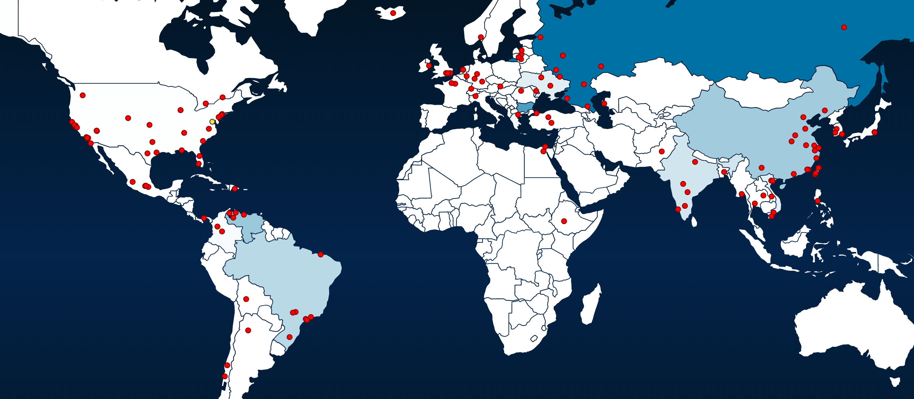

# Honeypot
Which Honeypot(s) you deployed  
Any issues you encountered  
A summary of the data collected: number of attacks, number of malware samples, etc.  
Any unresolved questions raised by the data collected  

### Deployed Honeypots
The honeypots I deployed were:
  * Dionaea
  * Amun
  * Cowrie
  * Conpot
  * ElasticHoney
  * p0f
  
### Issues Encountered
At first I had a lot of issues with my deployment. My hpfeeds-broker had a FATAL error and my supervisorctl would not run, causing my honeypots to not transmit any data to mhn-admin. I attempted to resolve this issue by following many of the threads in the MHN GitHub issues page and MHN Google Forum containing relevant topics. Eventually I decided to do a clean reinstall of the entire system which got everything working.  
With my new deployment I tried to deploy a Glastopf honeypot, but for some reason it does not display on the Sensors page so any attacks on it do not get displayed. I have chosen to simply omit this honeypot from my submission.
  
### Summary of Collected Data
I got a lot of attacks very quickly after my honeypots were deployed. The Dionaea honeypot is overwhelmingly the most attacked honeypot with the next honeypot, p0f, having **<5%** the amount of attacks the Dionaea honeypot does. The list drops of significantly form here with the last honey pot, ElasticHoney, having only **43** attacks.

**Total Attacks Recieved:** 631.166

**Most Attacks in 24 Hrs (approx):** 604,680
  
**Honeypots Ranked by Number of Attacks:**
  1. dionaea (591,471 attacks)
  2. p0f (29,333 attacks)
  3. amun (8,301 attacks)
  4. conpot (1,347 attacks)
  5. cowrie (67 attacks)
  6. elastichoney (43 attacks)
    
At first, many of the attacks displayed came from my nmap on the Dionaea honeypot but over time others surpassed my attacks. The most attacks occurred within the 24 hrs immediately following the deployment of the honeypots.
  
**The Top 5 Attacker IPs:**
  1.  37.147.42.77 (65,169 attacks) - Krasnodar, Russia
  2.  89.25.118.100 (64,660 attacks) - Botevgrad, Bulgaria
  3.  200.35.77.146 (55,631 attacks) - Agua Salada, Venezuela 
  4.  121.20.47.240 (50,600 attacks) - Zhengzhou, China
  5.  213.129.54.146 (50,359 attacks) - Yakutsk, Russia
  
While only **4** countries are represented in the top attacker rankings, attacks came from numerous countries around the world. this can be seen by the incoming attacks my honeypots were receiving on the honeymap.  
  

All attackers on the list achieved their ranking by attacking the Dionaea honeypot, which got a significantly higher amount of attacks than the others, making up **>93%** of the total attacks.  
  
**The Top 5 Attacked Ports:**
  1. 1433 (58,2075 times) - TCP/UDP 
  2. 80 (10,067 times) - HTTP
  3. 445 (6,580 times) - TCP
  4. 22 (6,392 times) - SSH
  5. 23 (1,417 times) - TCP  
  
#### Bonus Malware Samples
I received **13** dionaea.capture payloads, which I believe is the malware samples that were wanted as bonus points.
They are:
  url | daddr | saddr | dport | sport | sha512 | md5
  --- | ----- | ----- | ----- | ----- | ------ | ---
  | | 35.222.174.155 |	223.205.248.120 |	445 |	54706	| a823196596f18305c898c25590761dee23218f72bb7db629d63bb95cd3cf570184633017ee536bbcf831ae23c9f0678bfce4580b0cc49babfa9c731fd2c1e2e5 | 549ae01010e6b826a301851393ea8433 |
  | | 35.222.174.155 |	189.195.144.222 |	445 |	54951 | a823196596f18305c898c25590761dee23218f72bb7db629d63bb95cd3cf570184633017ee536bbcf831ae23c9f0678bfce4580b0cc49babfa9c731fd2c1e2e5 | 549ae01010e6b826a301851393ea8433 |
  | | 35.222.174.155 |	42.113.84.88 |	445 |	43606 |	64f223e762c17b750790a8ec483319e851e317164d662e8d1d56e8b3551e297f15e51ef52dfdc350d5f9f29ae4ad146501c343778671dbb934fc0116b50ceaa2 |	414a3594e4a822cfb97a4326e185f620 |
  | | 35.222.174.155 |	116.102.218.241 |	445 |	52951 |	64f223e762c17b750790a8ec483319e851e317164d662e8d1d56e8b3551e297f15e51ef52dfdc350d5f9f29ae4ad146501c343778671dbb934fc0116b50ceaa2 |	414a3594e4a822cfb97a4326e185f620 |
  | http://122.112.161.181:5512/VMwarL.exe |	35.222.174.155 |	223.93.161.186 |	3306 |	3581 |	ce7e145fad3d30d0c9a96a44260b195d5263d90b5dd9c42772c1821c165dc6db583d2550919de15d86cedfc1833d57b649af68fb743f68c45a0afe14974bffae |	3799b9dd83b6f21909cbbfe9c19eb325 |
  | http://122.112.161.181:5512/VMwarK.exe |	35.222.174.155 |	223.93.161.186 |	3306 |	4679 |	1bc0c5b72f2422b7d00d466e8bdcf741cde7e0e79b71b11a2d559fa38c0e6c50817a928fa479aa79062e2fdca047c342aa7a7a24e0ea82cccc80c51e94bf4a60 |	87feb320237589bf31eda518af146134 |
  | | 35.222.174.155 |	103.244.245.254 |	445 |	39457 |	f529e254fda09b34b261a5a133c93d877b0dcf157a1c494c634e113b7f96a57dfbc7a65bbe11941261ba253578452689296e56734f57c489dd46dfcb35ab4a25 |	ed03cfcc81546aee052e5d3360abda8d |
  | | 35.222.174.155 |	183.83.76.139 |	445 |	21450 |	47cc0dabfae78c8c405b3e447871be5725ca0d7294a89ba2927f62d6f105ad2c33bf3940a43555e5b4552366288af50965251ca2899292c09a131e9c8cfefd2f |	e49594ffa18e330c8692d88dc8e73752 |
  | | 35.222.174.155 |	14.231.131.218 |	445 |	49586 |	da2acf9fd0553b473802b6dd8cf35a0ac4e734f0a790f9c260db06f46f84ff452bd888297f662540bf60a895a3f196368d3e24d13dd9e0d4ca9e83d3cc1076de |	996c2b2ca30180129c69352a3a3515e4 |
  | | 35.222.174.155 |	203.81.71.222 |	445 |	50690 |	5954aeb1a675ef55ea7c25e2d63f48d3f51df7359cdf5eaaf767a87db17f75e8ac1ccc66d60b5e1135360770d4b5b504d8418b6d6e2485231c07adb3e4b73967 |	9ba5379aa41d707a4331d27a004baec1 |
  | | 35.222.174.155 |	114.5.99.134 |	445 |	58488 |	a80b1cc70cafff3b8edb2e732fa2360436cc7556ba91977ab1fa505ad7c6e184c465839d1584f827be17ccb751240432348debe69eed4e006321d9af4334621b |	ae12bb54af31227017feffd9598a6f5e |
  | | 35.222.174.155 |	223.205.248.120 |	445 |	54706 |	a823196596f18305c898c25590761dee23218f72bb7db629d63bb95cd3cf570184633017ee536bbcf831ae23c9f0678bfce4580b0cc49babfa9c731fd2c1e2e5 |	549ae01010e6b826a301851393ea8433 |
  | | 35.222.174.155 |	189.195.144.222 |	445 |	54951 |	a823196596f18305c898c25590761dee23218f72bb7db629d63bb95cd3cf570184633017ee536bbcf831ae23c9f0678bfce4580b0cc49babfa9c731fd2c1e2e5 |	549ae01010e6b826a301851393ea8433 |
  
### Unresolved Questions Raised by Collected Data

I don't understand why the Dionaea honeypot is the most attacked honeypot between all the ones I deployed. Considering the pattern, and it being the honeypot we were required to deploy it is probably the most attacked honeypot of all the MHN supported sensors. I tried to read up on what about Dionaea makes this the case, but found no results. Articles regarding honeypots corroborated my findings with Dionaea being their most attacked honeypot as well.  

The highest frequency of attacks happened within the first 24hrs after deploying the honeypots with traffic dropping off substantially to around **~2.5%** of its peak. While my honeypots are still recieving traffic, I did not expect such a large dropoff and am curious as to how and why this occurred. I guess attackers have recorded my honeypots as already explored, but the highest attacker IPs still send some attacks to my honeypots every once in a while.  
  
I also want to know what the attackers are attempting to gain from attacking vulnerable systems. I'm sure there are plenty of nefarious individuals out there, but I can't help but wonder exactly what kind of data they expect to find and if any of the attackers are state sponsored entities.  
  
### Notes  
Parse.py can be used in order to analyze the session.json file generated from mhn-admin. This file should work for any .json file obtained from MHN. The records can be obtained using:  
```  
mongoexport --db mnemosyne --collection session > session.json  
gcloud compute scp mhn-admin:~/session.json ./session.json  
```  
**Note:** The total attacks in 24 hrs on other session files will be wrong. This evaluation is configured to only work on session.json files that are begin at UTC Hour 00
     
**WARNING:** Running Parse.py can be a very memory intensive operation for some programs and may require an adjustment of memory thresholds if done in an IDE. For example: if using PyCharm, it is necessary to set *idea.max.content.load.filesize* to >200000 (>200 MB) in order to write to the file.
     
output.csv contains the protocol, timestamp\[$date\], source_ip, destination_port, and honeypot for each attack in that order as a csv file for viewing in Exel
ipAnalysis.txt contains the attacker IPs with their attack count in descending order in the form ip: count
portAnalysis.txt contains the attacked ports with their attack count in descending order in the form port: count  
modsession.json contains the sess.json data modified in way that can be read by Python
  
ip.txt, port.txt, and time.txt contain the extracted IP, port, and timestamp\[$date\] respectively for each record as a list. These created files are used to obtain the final statistics.  
